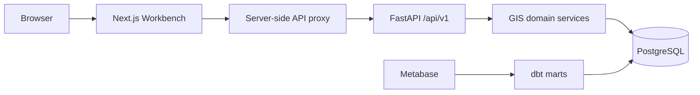
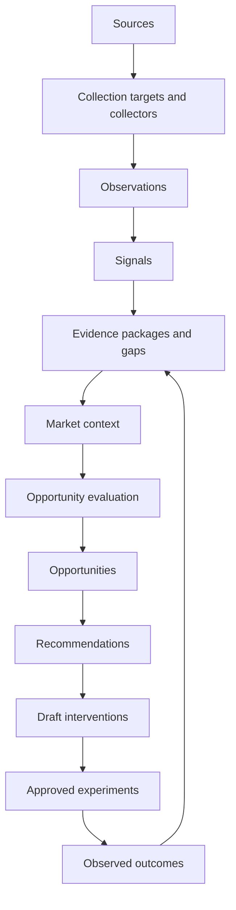

# GIS Application API and Intelligence Workbench

> **The GIS Workbench is an application over GIS domain services. It must not duplicate or bypass deterministic GIS business logic.**

> **Recommendation acceptance and intervention approval are separate operator decisions.**

Epic 8.5 provides the first cohesive operational application for GIS. CLI, dbt, and Metabase remain supported: the Workbench handles triage, review, approval, and workflow; Metabase remains the deeper analytical and BI surface.

## Architecture



The FastAPI routes live in `src/gis/api`. Typed request/response schemas, error handling, authentication/authorization, application queries, and routes are separated. Opportunity dismissal/restoration, recommendation generation/review, and intervention transitions call the established services. Read queries assemble bounded workflow views without changing domain semantics.

The Next.js application lives in `apps/workbench`. It uses one typed API client and a same-origin server proxy; the operator key is never compiled into browser JavaScript. The frontend does not contain database credentials, SQL, provider calls, rights overrides, or domain-state mutation logic.

## Site and tenant scope

Every operational request carries `tenant_id` and `site_id`. Resources are resolved in that combined scope and return `404` when crossed into another tenant/site. The frontend receives explicit configured IDs and can later replace this local selection with authenticated tenant/site membership.

Collections are bounded with `page` and `limit` (`1..100`). Filtering is server-side for opportunity status, family, priority, and text search. Important detail resources have stable URLs.

## API resources

OpenAPI and interactive documentation are exposed by FastAPI at `/openapi.json` and `/docs`.

- System: health, site status, work queues, capability/freshness/schedule state.
- Markets: definitions and participants/members.
- Collection: targets and current plan inspection; no activation endpoint.
- Evidence: packages, quality dimensions, items, conflicts, gaps, rights usability, and provenance fields.
- Opportunities: inbox, detail, evaluation history, evidence-linked context, dismiss/restore, and recommendation generation.
- Recommendations: list/detail, candidates, review history, accept/reject.
- Interventions: list/detail, lifecycle history, outcomes, propose/approve/reject/start/complete/cancel.
- Experiments and outcomes: read-only foundational views. Outcomes are labeled observed change, never causal impact.

## Authentication and authorization

Epic 8.5 intentionally implements a local, single-operator boundary rather than a commercial identity platform. Set `GIS_API_OPERATOR_KEY` to a high-entropy local secret. Application routes fail closed when it is absent. The API centrally checks `READ`, `REVIEW`, `APPROVE`, and `ADMIN` roles. The Workbench server proxy supplies the secret and local `ADMIN` role; browsers do not receive it.

This is not production authentication. There is no SSO, user directory, tenant membership, session management, or commercial RBAC. Do not expose the control plane publicly. A future authenticated gateway must derive roles and tenant/site membership from verified identity rather than trusting a role header.

No cookie session is introduced, so CSRF does not apply to the current header-authenticated API. CORS defaults narrowly to `http://localhost:3000`, credentials are disabled, and both API and frontend set basic hardening headers.

## Errors, concurrency, and idempotency

Application errors use:

```json
{
  "error": {
    "code": "STALE_RESOURCE",
    "message": "Resource changed after it was loaded.",
    "request_id": "uuid",
    "details": null,
    "retryable": false
  }
}
```

The API maps not-found to `404`, role/rights blocks to `403`, stale or invalid lifecycle transitions to `409`, contract validation to `422`, and unavailable authentication/providers to `503`. It does not expose stack traces, SQL, secrets, tokens, or connection strings.

Human state transitions accept `expected_updated_at` as an optimistic concurrency precondition. Domain services retain their existing idempotency: recommendation generation uses the Epic 8 context hash; repeated lifecycle transitions follow Epic 9A rules. UI mutations disable controls while pending and reload authoritative state after completion.

## Governed operator workflow

1. Open the Opportunity Inbox.
2. Review the condition, analytical entity, evidence strength, market context, history, and limitations.
3. Explicitly generate a recommendation if eligible. The current provider is labeled **Fixture / development recommendation provider**; production AI is not represented as operational.
4. Review candidates, rationale, target metric, expected direction, feasibility, measurement readiness, assumptions, and limitations.
5. Accept a candidate. Epic 8 creates a `DRAFT` intervention only.
6. Open that intervention on a separate page, propose it, then deliberately approve or reject it.
7. Approval changes lifecycle authorization only. It does not schedule or execute customer-system changes.
8. Track foundational experiment/measurement state and observed outcomes later.

Evidence gaps, insufficient support, unknown freshness, and rights/provider blockers remain explicit. The interface preserves `UNKNOWN != ZERO`, `INSUFFICIENT != NEGATIVE`, and `MISSING != RESOLVED`.

## Local development

Start PostgreSQL and migrate:

```bash
docker compose up -d db
python -m pip install -e '.[dev]'
alembic upgrade head
gis-seed
```

Configure `.env`:

```bash
GIS_API_OPERATOR_KEY=<generate-a-private-local-value>
GIS_API_CORS_ORIGINS=http://localhost:3000
GIS_API_BASE_URL=http://127.0.0.1:8000
NEXT_PUBLIC_GIS_TENANT_ID=<tenant-uuid>
NEXT_PUBLIC_GIS_WORKBENCH_SITE_ID=<site-uuid>
NEXT_PUBLIC_METABASE_URL=http://localhost:3030
```

Run the API:

```bash
set -a; source .env; set +a
gis-api
```

Run the Workbench:

```bash
scripts/bootstrap-local.sh
scripts/dev-workbench.sh
```

The launcher exports the root `.env`, verifies the editable GIS import, and uses API port 8001 and
Workbench port 3001. Next.js development and production builds use separate cache directories so
a validation build cannot corrupt a running development server's chunk manifest.

Validation:

```bash
pytest -q tests/test_workbench_api.py
cd apps/workbench
npm run lint
npm run typecheck
npm test
npm run build
```

Metabase remains at the configured `NEXT_PUBLIC_METABASE_URL` and is linked from the Workbench navigation. Epic 8.5 does not reset or replace it.

## Security and operational limitations

- Local-first only; no public deployment or cloud resources are created.
- Fixture AI only; external inference remains rights/configuration blocked.
- No paid collection or AI calls, schedule activation, CMS writes, GitHub changes, publishing, autonomous execution, or customer-site mutation.
- Collection is inspection-only in the Workbench because activation/spend requires a stronger explicit workflow.
- Experiment/outcome views reflect Epic 9A foundation; Epic 9B and later execution capabilities are not invented here.
- Observational outcomes are not causal effects.
- No database migration is required for Epic 8.5.

Future work can add verified authentication and commercial tenant membership, Epic 9B execution, specialized opportunity engines, Epic 27 learning, customer-side integrations, and productized multi-tenancy without changing the API/domain-service boundary.

## Semantic exploration model

The Workbench presents governed objects by human identity—market name, query, domain, URL, evidence subject, pipeline name, or source name—while keeping UUIDs in technical metadata. Evidence status comes from `EvidencePackage.sufficiency`; the package model has no generic `status` field. A bare `UNKNOWN` in the original interface was therefore a presentation fallback, not an evidence-quality conclusion.

Reusable explorer and detail components provide linkable URL-state pagination, 25/50/100 page sizes, search, domain filters, human timestamps, metric-aware numbers, breadcrumbs, meaningful empty states, relationship sections, and progressive disclosure for provenance and rights. Evidence packages, gaps, markets, collection targets, pipelines, sources, and runs have stable detail routes.

Collection target states retain their actual lifecycle semantics:

- `CANDIDATE`: discovered and evaluated, but not promoted into an applied plan.
- `ACTIVE`: included in the applied collection plan.
- `DORMANT`: retained but not currently prioritized.
- `PAUSED`: deliberately suspended without retirement.
- `REJECTED`: explicitly excluded after evaluation.
- `RETIRED`: no longer eligible for routine collection.

The collection detail view exposes discovery evidence, the latest planning decision, deterministic component scores, unknown components, blocker, cadence, collector plan, demand signals, evidence gaps, and market relationship where stored.

## Opportunity explainability

`GET /api/v1/opportunity-evaluations` runs read-only diagnostics from the same `DETECTORS` registry and detector version used by `OpportunityService`. It does not write evaluation rows, create opportunities, or change thresholds. Each package/detector pair exposes contract, classification, rights, conflicts, required entity context, and sufficiency conditions with required and observed values.

The current stored packages do not qualify because their classifications are `STABLE`, `DECLINING`, or `FIRST_OBSERVED`; the existing detectors require `EMERGING` or `ACCELERATING`. The interface reports closest candidates by explicit conditions satisfied, not a probability, hidden score, predicted lift, or ROI.

## System observability

System is organized around Overview, Pipelines, Data Sources, Data Flow, and Run History. Pipeline details show maintained purpose, collector/local classification, schedule and human cadence, run history, volume, cost, budgets, dependencies, reliability, and transparent health. Source details use registered `DataSource`, `DataSourceConnection`, rights, ingestion, pipeline, asset-source, and lineage metadata; credential references and secret-like configuration keys are never returned.

Pipeline health uses explicit states: `HEALTHY`, `STALE`, `FAILING`, `DISABLED`, `NOT_APPLICABLE`, and `INSUFFICIENT_HISTORY`. It is not an opaque score. Thirty-day reliability compares enabled-schedule occurrences with orchestration attempts. A missed execution is an enabled schedule occurrence without an attempt inside the displayed timing tolerance. Disabled schedules never accrue misses, and fewer than two expected executions is reported as insufficient history.

The data-flow view renders only registered source-to-pipeline assignments, `PipelineDependency`, `DataAssetSource`, and `DataAssetLineage` edges. Missing metadata is identified as unmapped rather than inferred.



The flow remains human governed: recommendation acceptance creates a draft intervention, approval is separate, and no Workbench read view activates schedules, collectors, providers, or execution.

## Page purpose model

- Overview: what should the operator know now?
- Opportunities: where might VAHomeMath improve, and why did evidence qualify or fail?
- Recommendations: what should a reviewer consider?
- Interventions: what has a human decided to do?
- Evidence: what does GIS know and how reliable is it?
- Market: what bounded environment is being observed?
- Collection: what is observed, missing, planned, or blocked?
- Experiments: what is deliberately being tested?
- Outcomes: what changed after action, without claiming causality?
- System: can GIS currently produce trustworthy intelligence, and what depends on each source or pipeline?
- Learn GIS: what the product is, how its concepts and workflows fit together, and where its trust boundaries apply?

## Product documentation as a quality requirement

The first-class `/docs` Workbench area is operator-facing product documentation, not an API reference or developer README. Its structured, version-controlled content lives in `apps/workbench/content/docs.ts`; rendering, navigation, search, anchors, live-state callouts, and responsive presentation are reusable application concerns rather than scattered page strings.

Documentation explains stable concepts and methodology. Live System pages remain authoritative for transient source connections, schedules, runs, reliability, records, rights, cost, quotas, health, and dependencies. Small documentation callouts may query existing APIs, but maintained prose must never hardcode current counts or imply a live state.

Every future epic that adds or materially changes a source family, pipeline family, domain object, detector, lifecycle, governance rule, or primary Workbench section must update the corresponding product documentation and glossary in the same change. New content should:

- use actual backend lifecycle and rights semantics;
- distinguish conceptual behavior from current environment state;
- link to live source, pipeline, lineage, evidence, or decision views instead of copying runtime facts;
- state empty, unknown, blocked, and insufficient-history behavior explicitly;
- preserve human review and execution boundaries;
- include or update a catalog test when it adds a required operator journey.
