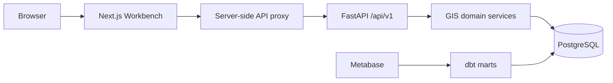

# GIS Application API and Intelligence Workbench

> **The GIS Workbench is an application over GIS domain services. It must not duplicate or bypass deterministic GIS business logic.**

> **Recommendation acceptance and intervention approval are separate operator decisions.**

Epic 8.5 provides the first cohesive operational application for GIS. CLI, dbt, and Metabase remain supported: the Workbench handles triage, review, approval, and workflow; Metabase remains the deeper analytical and BI surface.

## Architecture



The FastAPI routes live in `src/gis/api`. Typed request/response schemas, error handling, authentication/authorization, application queries, and routes are separated. Opportunity dismissal/restoration, recommendation generation/review, and intervention transitions call the established services. Read queries assemble bounded workflow views without changing domain semantics.

The Next.js application lives in `apps/workbench`. It uses one typed API client and a same-origin server proxy; the operator key is never compiled into browser JavaScript. The frontend does not contain database credentials, SQL, provider calls, rights overrides, or domain-state mutation logic.

## Site and tenant scope

Every operational request carries `tenant_id` and `site_id`. Resources are resolved in that combined scope and return `404` when crossed into another tenant/site. The frontend receives explicit configured IDs and can later replace this local selection with authenticated tenant/site membership.

Collections are bounded with `page` and `limit` (`1..100`). Filtering is server-side for opportunity status, family, priority, and text search. Important detail resources have stable URLs.

## API resources

OpenAPI and interactive documentation are exposed by FastAPI at `/openapi.json` and `/docs`.

- System: health, site status, work queues, capability/freshness/schedule state.
- Markets: definitions and participants/members.
- Collection: targets and current plan inspection; no activation endpoint.
- Evidence: packages, quality dimensions, items, conflicts, gaps, rights usability, and provenance fields.
- Opportunities: inbox, detail, evaluation history, evidence-linked context, dismiss/restore, and recommendation generation.
- Recommendations: list/detail, candidates, review history, accept/reject.
- Interventions: list/detail, lifecycle history, outcomes, propose/approve/reject/start/complete/cancel.
- Experiments and outcomes: read-only foundational views. Outcomes are labeled observed change, never causal impact.

## Authentication and authorization

Epic 8.5 intentionally implements a local, single-operator boundary rather than a commercial identity platform. Set `GIS_API_OPERATOR_KEY` to a high-entropy local secret. Application routes fail closed when it is absent. The API centrally checks `READ`, `REVIEW`, `APPROVE`, and `ADMIN` roles. The Workbench server proxy supplies the secret and local `ADMIN` role; browsers do not receive it.

This is not production authentication. There is no SSO, user directory, tenant membership, session management, or commercial RBAC. Do not expose the control plane publicly. A future authenticated gateway must derive roles and tenant/site membership from verified identity rather than trusting a role header.

No cookie session is introduced, so CSRF does not apply to the current header-authenticated API. CORS defaults narrowly to `http://localhost:3000`, credentials are disabled, and both API and frontend set basic hardening headers.

## Errors, concurrency, and idempotency

Application errors use:

```json
{
  "error": {
    "code": "STALE_RESOURCE",
    "message": "Resource changed after it was loaded.",
    "request_id": "uuid",
    "details": null,
    "retryable": false
  }
}
```

The API maps not-found to `404`, role/rights blocks to `403`, stale or invalid lifecycle transitions to `409`, contract validation to `422`, and unavailable authentication/providers to `503`. It does not expose stack traces, SQL, secrets, tokens, or connection strings.

Human state transitions accept `expected_updated_at` as an optimistic concurrency precondition. Domain services retain their existing idempotency: recommendation generation uses the Epic 8 context hash; repeated lifecycle transitions follow Epic 9A rules. UI mutations disable controls while pending and reload authoritative state after completion.

## Governed operator workflow

1. Open the Opportunity Inbox.
2. Review the condition, analytical entity, evidence strength, market context, history, and limitations.
3. Explicitly generate a recommendation if eligible. The current provider is labeled **Fixture / development recommendation provider**; production AI is not represented as operational.
4. Review candidates, rationale, target metric, expected direction, feasibility, measurement readiness, assumptions, and limitations.
5. Accept a candidate. Epic 8 creates a `DRAFT` intervention only.
6. Open that intervention on a separate page, propose it, then deliberately approve or reject it.
7. Approval changes lifecycle authorization only. It does not schedule or execute customer-system changes.
8. Track foundational experiment/measurement state and observed outcomes later.

Evidence gaps, insufficient support, unknown freshness, and rights/provider blockers remain explicit. The interface preserves `UNKNOWN != ZERO`, `INSUFFICIENT != NEGATIVE`, and `MISSING != RESOLVED`.

## Local development

Start PostgreSQL and migrate:

```bash
docker compose up -d db
python -m pip install -e '.[dev]'
alembic upgrade head
gis-seed
```

Configure `.env`:

```bash
GIS_API_OPERATOR_KEY=<generate-a-private-local-value>
GIS_API_CORS_ORIGINS=http://localhost:3000
GIS_API_BASE_URL=http://localhost:8000
NEXT_PUBLIC_GIS_TENANT_ID=<tenant-uuid>
NEXT_PUBLIC_GIS_WORKBENCH_SITE_ID=<site-uuid>
NEXT_PUBLIC_METABASE_URL=http://localhost:3030
```

Run the API:

```bash
set -a; source .env; set +a
gis-api
```

Run the Workbench:

```bash
cd apps/workbench
npm ci
npm run dev
```

Validation:

```bash
pytest -q tests/test_workbench_api.py
cd apps/workbench
npm run lint
npm run typecheck
npm test
npm run build
```

Metabase remains at the configured `NEXT_PUBLIC_METABASE_URL` and is linked from the Workbench navigation. Epic 8.5 does not reset or replace it.

## Security and operational limitations

- Local-first only; no public deployment or cloud resources are created.
- Fixture AI only; external inference remains rights/configuration blocked.
- No paid collection or AI calls, schedule activation, CMS writes, GitHub changes, publishing, autonomous execution, or customer-site mutation.
- Collection is inspection-only in the Workbench because activation/spend requires a stronger explicit workflow.
- Experiment/outcome views reflect Epic 9A foundation; Epic 9B and later execution capabilities are not invented here.
- Observational outcomes are not causal effects.
- No database migration is required for Epic 8.5.

Future work can add verified authentication and commercial tenant membership, Epic 9B execution, specialized opportunity engines, Epic 27 learning, customer-side integrations, and productized multi-tenancy without changing the API/domain-service boundary.
