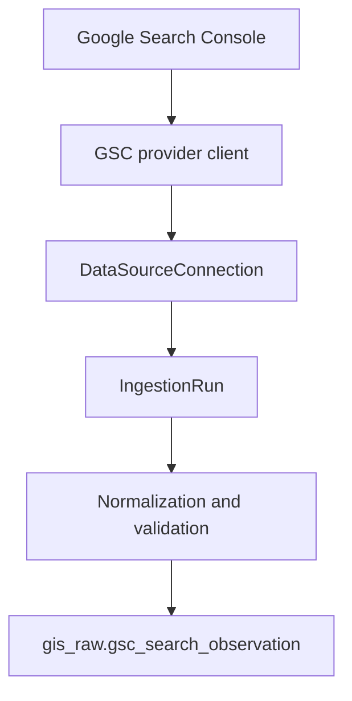

# GIS data-platform architecture

## Purpose

GIS is the decision-intelligence layer above VAHomeMath's operational systems. Epic 1 created
the durable PostgreSQL foundation. Epic 2 validates it with typed, historical Google Search
Console Search Analytics collection and Epic 3 adds aggregate GA4 behavioral reporting without
introducing user-facing behavior.

VAHomeMath is the first tenant and site, but no table assumes it is the only one. UUIDs are
internal identifiers; slugs and provider identifiers are stable lookup attributes rather than
primary keys.

## Namespaces

Core relational objects live in `gis_core`. Provider observations live in `gis_raw`, first used
by GSC and GA4 observation tables. `gis_analytics` remains reserved until a future epic has concrete
analytical objects.

## Ownership and integrity

Tenant identity is explicit on every tenant-scoped table. Composite foreign keys ensure a
site, domain, connection, or ingestion run cannot accidentally point across tenants. A site
belongs to an organization in the same tenant. A connection may be tenant-wide or site-bound.

The source registry is global because provider definitions such as Google Search Console are
shared vocabulary, not customer data. Its connections are tenant-owned. Rights policies may
be global defaults (`tenant_id` is null) or tenant-specific overrides. A connection's optional
`rights_policy_id` is the designed override point for its source default. Composite integrity
requires an override policy to belong to the same tenant; global policies remain source defaults.

## Provenance and history

Observations are append-oriented. Do not update historical facts to represent a newer sample.
The `ProvenanceMixin` defines the conventional columns for future typed observation models:

- source connection and source record identifier;
- ingestion batch/run;
- observed, ingested, and effective timestamps;
- confidence and quality flag;
- external raw-payload reference;
- the rights policy governing the observation.

Future tables should copy or use this clear column convention and add their own domain-specific
columns. They should not create a universal observation table, ORM inheritance hierarchy, or
entity-attribute-value model. Add indexes based on actual query shapes, commonly tenant/site,
observation time, source connection, and batch.

GSC facts are versioned rather than overwritten. A stable logical key identifies a
tenant/site/connection/date/grain/dimension combination. When Google revises metrics, the
collector closes the current effective interval and appends a new version. Identical reruns do
nothing, while every collection attempt still has its own `ingestion_run`.

Raw payload references point to managed external storage; payloads and credentials do not
belong in ordinary relational credential fields. `credential_reference` stores a secret-manager
reference only.

GA4 follows the same revision convention with separate landing-page, acquisition, and event
aggregate tables. This preserves domain-specific relational types while allowing later analytical
models to join GSC acquisition intent with GA4 behavior through tenant, site, date, and normalized
page dimensions.

First-party telemetry uses transactional HTTP ingestion rather than scheduled provider pulls.
Canonical `session`, `event`, `calculator_run`, and `conversion` entities live in `gis_core` and
carry connection and rights provenance without creating an `ingestion_run` per request. See
[first-party telemetry](first-party-telemetry.md).

## Time and configuration

All event timestamps use PostgreSQL `timestamp with time zone` and applications should write
UTC. `site.timezone` separately retains the IANA business timezone. Provider-specific,
non-secret connection settings may use `configuration_json`; stable ownership and policy
concepts remain relational.

## GSC data flow

## GA4 data flow

See [the GA4 integration guide](ga4-integration.md) for the report catalog, authentication,
timezone behavior, versioning, and operational limits.
