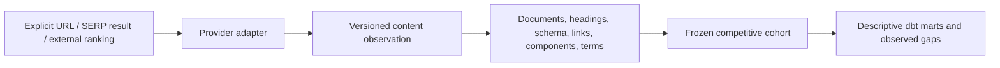

# Competitive content intelligence

Epic 17 turns bounded ranking URLs into historical, provider-neutral content evidence. It does not
score opportunities, make causal SEO claims, call an LLM, or recommend content changes.

## Collection architecture



The first adapter is `DIRECT_HTTP`. Ordinary public HTML is less expensive and more transparent to
retrieve directly than through a paid scraping API. The adapter is still behind a provider-neutral
retrieval contract. Future provider-rendered and browser-rendered adapters can populate the same
canonical tables and set `render_mode` accordingly.

Collection is limited to 20 explicitly selected URLs per command. The collector does not discover
or crawl links recursively. Candidate URLs can be selected from existing controlled SERP results,
external-search rankings, or supplied explicitly; the observation retains the relevant source IDs.

## Retrieval security and limitations

Direct retrieval accepts only HTTP(S), rejects URL credentials, resolves every hostname, and blocks
localhost, private, loopback, link-local, reserved, and cloud-metadata addresses. Redirect targets
are validated independently. It uses bounded connect/read timeouts, four redirects, a two-megabyte
response limit, an explicit user agent, and HTML/XHTML content types only. It performs no CAPTCHA,
authentication, paywall, anti-bot, browser, or robots-circumvention behavior.

`RAW_HTTP` does not execute JavaScript. Missing JavaScript-rendered elements mean “not observable in
this render mode,” not confirmed absence. Future adapters should use `PROVIDER_RENDERED` or
`BROWSER_RENDERED`. DNS validation reduces SSRF exposure, but production deployments should also
apply an outbound-network allow policy to mitigate DNS rebinding at the infrastructure layer.

## Storage, history, and freshness

`gis_raw.competitive_content_observation` is a revision envelope. Its identity is site, requested
URL, and observation date. An identical content hash is an idempotent replay; changed content closes
the current version and appends a new immutable version. Retrieval and observation timestamps remain
separate. Failed retrievals remain failed ingestion runs and do not become zero-valued documents.

Raw HTML is not stored in PostgreSQL. GIS retains a SHA-256 hash, retrieval metadata, and extracted
facts. `raw_payload_reference` reserves an object-storage reference for a future policy-approved raw
retention adapter. This separates raw retention rights and volume from normalized evidence. A hash
detects byte changes; it does not imply semantic equivalence. Publication, modified, and HTTP
last-modified dates retain their individual sources and are never collapsed into a “true” date.

## Deterministic extraction

The standard-library HTML parser extracts title, description, canonical, language, robots, visible
text, paragraphs, H1/H2/H3 counts and ordered headings, lists, tables, images, video/embed/form/iframe
counts, JSON-LD types, normalized links, anchor text, and link relationship attributes. Navigation,
footer, scripts, style, SVG, and noscript text are excluded from the visible-text measure.

DOM counts and parsed schema/link facts are `MEASURED`. Normalized visible-text word count is
`GIS_DERIVED`. FAQ, calculator/tool, references, byline, and CTA detection uses documented lexical
rules (`LEXICAL_HEURISTIC_V1`) and is `HEURISTIC` with confidence; it is not measured truth. External
links are classified as external, never automatically as authoritative citations.

Terms use deterministic one-, two-, and three-token heading n-grams after case folding, punctuation
removal, and a small fixed stop-word list (`HEADING_NGRAM_V1`). They are lexical GIS-derived evidence,
not semantic topics. A later embedding or LLM layer may augment these rows without replacing them.

## Cohorts and observed gaps

A cohort freezes explicit observation IDs, optional tracked query, membership source, and observed
rank positions. Later ranking changes cannot rewrite historical membership. The gap mart counts the
fraction of competitor cohort pages containing a heading term and whether an owned cohort page lacks
that same lexical term. Its semantic label is `OBSERVED_DIFFERENCE_NOT_RECOMMENDATION`.

The marts expose page, query, domain, component, and term measurements. They can join tracked-query,
SERP-result, and external-search observation IDs without collapsing those distinct evidence types.
GSC and experience data remain separate unless their grains align in a future explicit model.

## Rights and provenance

Public accessibility is not permission. Before any HTTP request, collection requires the connection's
`normalized_retention` use to be `ALLOWED`; `UNKNOWN` and `DENIED` fail closed. Raw HTML is not retained.
Policy owners must separately review transient retrieval, raw retention, normalized retention,
derivative facts, aggregates, customer display, export, RAG, AI inference, and training. Epic 17 does
not alter an existing policy or make legal conclusions.

The ingestion run captures source connection, resolved policy/version, acquisition method, collector,
and schema version. All canonical/staging/intermediate/mart assets are registered through the dbt
manifest; raw content assets map to the public-web source and downstream rights aggregate
conservatively (`DENIED > UNKNOWN > ALLOWED`).

## CLI and cost

```bash
gis-content-intelligence configure --tenant vahomemath --site vahomemath
gis-content-intelligence validate --connection <uuid>
gis-content-intelligence estimate --pages 3
gis-content-intelligence collect --connection <uuid> --site <uuid> \
  --url https://example.com/page --dry-run
gis-content-intelligence collect --connection <uuid> --site <uuid> \
  --url https://example.com/page
gis-content-intelligence collect --connection <uuid> --site <uuid> \
  --tracked-query-id <uuid> --top 10 --dry-run
gis-content-intelligence collect --connection <uuid> --site <uuid> \
  --external-search-observation-id <uuid> --domain example.com --top 10 --dry-run
gis-content-intelligence cohort --site <uuid> --name "query cohort" \
  --observation-id <owned> --observation-id <competitor>
gis-content-intelligence compare --cohort <uuid> --owned-observation <uuid>
gis-content-intelligence inspect --observation-id <uuid>
```

Direct HTTP has no provider fee, so its preflight estimate is USD 0. Network and infrastructure costs
are not represented as provider charges. Paid future adapters must report dated unit assumptions,
preflight maximums, request/task counts, and provider actual cost. Dry-run validates bounds and makes
no HTTP or paid-provider request.

## Known limitations and future adapters

- No JavaScript rendering, recursive crawl, soft-404 classifier, sitemap dates, or semantic clustering.
- Content extraction is designed for ordinary HTML and can be affected by unusual markup.
- Topic/component prevalence is descriptive and must never be presented as a ranking cause.
- Median rank-band relationships need sufficiently populated frozen cohorts and remain descriptive.
- DataForSEO, commercial crawl, Common Crawl, BYOD, and rendered adapters can implement the retrieval
  contract and canonical semantics without changing the schema.

Epic 7 can consume the compact cohort/gap evidence later. Epic 17 itself produces no opportunity,
recommendation, content brief, autonomous change, AI inference, embedding, RAG, or model-training flow.
