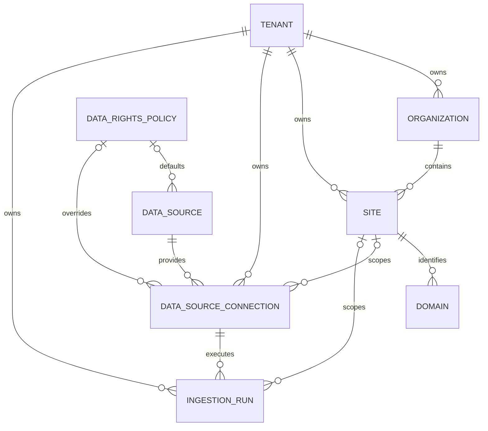

# GIS foundation data model

## Tables

`tenant` is the security and ownership boundary. Its globally unique slug is a stable lookup
key and status is explicitly managed.

`organization` groups sites within a tenant. Its slug is unique within that tenant.

`site` represents a web property or product. Sites belong to an organization in the same
tenant, have a canonical URL and business timezone, and have tenant-local unique slugs.

`domain` records hostnames historically associated with a site. The same hostname can be
modeled intentionally for different tenants/sites, while duplicates within one site are
rejected. A partial unique index permits only one primary domain per site.

`data_rights_policy` records machine-readable rights. Every permission uses `ALLOWED`,
`PROHIBITED`, or `UNKNOWN`; missing knowledge can never silently become permission. Null is
reserved for genuinely inapplicable metadata such as an unknown retention period or absent
license URL. This epic stores policy metadata but does not implement enforcement.

`data_source` is the extensible provider registry. Keys are unique strings; adding a provider
does not require changing an enum. `source_type` provides broad operational classification.

`data_source_connection` associates a source with a tenant and optionally a site. Configuration
is JSONB, credentials are references, and sync timestamps support later connector operations.
The optional rights policy overrides the source default.

`ingestion_run` records collection executions with status, counts, cursor, errors, and timing.
Successful, partial, and failed runs all remain historical records.

## Future typed observations

New observation tables should use UUID primary keys, explicit `tenant_id`, appropriate optional
`site_id`, and the provenance convention in `gis.models.ProvenanceMixin`. Add composite tenant
foreign keys so database constraints prevent cross-tenant associations. Use typed columns for
stable facts, JSONB only for provider-specific metadata, and never overwrite older observations
to represent the newest state.
