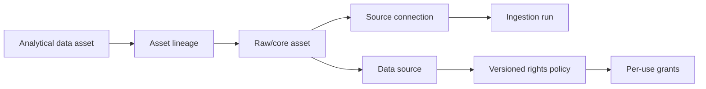

# Data rights and provenance

## Purpose and limits

GIS records operational policy decisions and documented provenance. It does not make legal
conclusions. Every governed use resolves to `ALLOWED`, `DENIED`, or `UNKNOWN`; enforcement permits
only `ALLOWED`. Missing policies, missing grants, and incomplete source traces remain `UNKNOWN`.



First-party events arrive transactionally and retain connection and policy IDs directly. They do
not receive invented ingestion runs. Periodic GSC and GA4 observations retain their real ingestion
run, connection, and policy IDs.

## Policy model

`data_rights_policy` contains policy identity, version, effective/expiration dates, superseded
policy, documented basis, terms/license reference, review authority/time, attribution, retention,
jurisdiction notes, and operational notes. An observation retains the policy ID applicable when it
was acquired, so a later policy version does not rewrite history.

`data_rights_grant` independently records these uses:

- internal analysis and commercial use
- raw and normalized retention
- derivative creation and aggregate statistics
- external publication
- raw and normalized redistribution
- customer-facing display and customer export
- RAG retrieval, AI inference, and AI training

Existing Epic 1 fields remain supported for compatibility. New grants take precedence. Uses that
cannot be represented exactly by a legacy field are `UNKNOWN`, not inferred.

For multi-source assets, `DENIED` dominates `UNKNOWN`, and `UNKNOWN` dominates `ALLOWED`.
Attribution requirements are retained alongside the result. Retention days are policy metadata;
this epic provides the decision substrate but does not run a deletion scheduler.

## Sources and acquisition

Sources are provider definitions; connections are tenant/site-specific access configurations.
`acquisition_method` is one of first-party, public/authenticated/licensed API, open data, public
web, user-provided, manual import, other, or unknown. Source records can hold authoritative and
terms URLs, never credentials. Connections keep only credential references.

GSC and GA4 are classified structurally as authenticated APIs. First-party telemetry and Git are
first-party. Scrapy/Playwright represent public-web acquisition mechanisms, and manual entry is a
manual import. These classifications do not grant usage rights.

## Ingestion and observations

`ingestion_run` records tenant/site/connection, applicable policy, acquisition method, collector,
collector/schema versions, requested time window, source metadata, cursor, status, timestamps, and
received/inserted/updated/rejected/error counts. Historical rows are backfilled only when the
applicable connection/source policy can be resolved; otherwise policy remains null honestly.

GSC and GA4 observations already resolve as:

```text
observation -> ingestion_run -> data_source_connection -> data_source -> data_rights_policy
```

Their observation-level policy IDs preserve acquisition-time policy. First-party sessions, events,
calculator runs, and conversions resolve directly to connection/source/policy.

## Transformation lineage and dbt

`data_asset` identifies raw tables, dbt models, datasets, metrics, future evidence, and other
assets. `data_asset_lineage` stores directed upstream-to-downstream transformation edges.
`data_asset_source` anchors raw or other assets to sources, optional connections, and optional
policy snapshots. Cycles and self-links are rejected by the registration service.

After `dbt build`, register the deterministic manifest:

```bash
gis-provenance register-dbt --manifest analytics/target/manifest.json
```

Registration is idempotent. It imports dbt nodes and dependencies, records model file references,
and links current GSC, GA4, and telemetry sources to their raw/core assets. For example:

```text
gis_analytics.mart_page_daily
  -> gis_intermediate.int_search_page_daily
  -> gis_staging.stg_gsc_search_observations
  -> gis_raw.gsc_search_observation
  -> Google Search Console source/policy

gis_analytics.mart_page_daily
  -> gis_intermediate.int_behavior_page_daily
  -> gis_staging.stg_ga4_landing_pages
  -> gis_raw.ga4_landing_page_observation
  -> GA4 source/policy
```

Metabase consumes marts and is not a lineage system of record.

## Evaluation and enforcement

Python callers use:

```python
evaluation = evaluate_asset_use(session, asset, PermittedUse.EXTERNAL_PUBLICATION)
assert_use_allowed(evaluation)  # raises for DENIED and UNKNOWN
```

Evaluators also accept policies, sources, and connections. Results include use, status, policy ID
and version, reason, attribution requirements, and contributors. There is no LLM in evaluation.

Operator examples:

```bash
gis-provenance source google_search_console
gis-provenance policy google_search_console
gis-provenance evaluate google_search_console --use external_publication
gis-provenance evaluate gis_analytics.mart_page_daily --asset --use rag_retrieval
gis-provenance lineage gis_analytics.mart_page_daily
gis-provenance trace gis_analytics.mart_page_daily
```

Evaluation exits `0` only for `ALLOWED`, `3` for `DENIED`, `4` for `UNKNOWN`, and `2` for invalid
input. Output is JSON and excludes credential references/configuration.

## Evidence graph extension point

Future findings can use `data_asset` with type `EVIDENCE`, connect it to observation/dataset assets,
and then reference that evidence from typed finding tables. This preserves a relational chain to
sources and rights without a generic graph database, EAV model, or pgvector. Findings,
opportunities, recommendations, RAG, and AI integrations are intentionally not implemented here.

## Future source checklist

Every future external-data epic must:

1. register a provider-neutral source and separate tenant connection;
2. record acquisition method and authoritative/terms references;
3. attach a reviewed, versioned policy or remain `UNKNOWN`;
4. snapshot policy and collector details on ingestion runs;
5. retain run/connection/policy IDs on observations where operationally real;
6. register raw assets and dbt lineage;
7. evaluate and enforce the intended use before publication, export, customer display, RAG, or AI;
8. add tests for restricted and unknown rights.

## Human review and limitations

The Workbench source page now provides administrator-only, site-connection-scoped
rights review. It creates new policies and explicit per-use grants, captures the human
authority/basis/version with server review time, and changes only that connection's
current policy pointer. It preserves all old policy/grant snapshots and acquisition
history. Source defaults, other connections, schedules and provider authorization are
not changed. A stale submitted policy ID is rejected; reviews are effective now rather
than scheduled for future activation. Per-use grants take precedence over compatibility
fields. Policy history exposes previous per-use decisions as well as review metadata.

Endpoints: `GET /api/v1/connections/{id}/rights` and administrator-only
`POST /api/v1/connections/{id}/rights/reviews`, with tenant/site scope. This workflow
does not invoke the older bulk activation/bootstrap command or rewrite historical data.

Seeded source permissions remain intentionally `UNKNOWN`, including Google Search Console, GA4,
first-party telemetry, VA, Census, FHFA, Google Ads/Trends, DataForSEO, Ahrefs, Semrush, BuiltWith,
Scrapy, Playwright, Git, and manual imports. Acquisition method is not permission. A qualified human
must document each policy basis, dates, version, attribution, retention, and grants. This epic does
not enforce timed deletion, conduct license review, or retrofit rights checks into dashboards.
