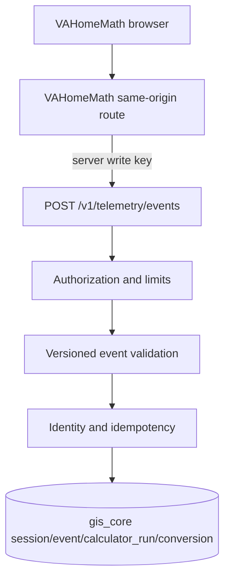

# First-party product telemetry

## Architecture and boundary



GIS first-party sessions are not GA4 sessions. Canonical GIS events are exact accepted product
events, while GA4 tables contain provider-reported aggregates. No `ingestion_run` is created for
real-time requests: it would create millions of semantically misleading one-event runs. Each event
instead records its source connection, governing rights policy, occurrence time, and receipt time.

## Deployment and authorization

The initial secure deployment pattern is browser → VAHomeMath same-origin server route → GIS.
The browser must not receive the GIS write key. Configure an active site connection using the
existing `first_party` source and a credential reference:

```bash
export TELEMETRY_WRITE_CREDENTIAL='{"write_key":"replace-with-a-long-random-secret"}'
gis-telemetry configure --tenant vahomemath --site vahomemath \
  --credential-reference env:TELEMETRY_WRITE_CREDENTIAL
uvicorn gis.api.app:app --host 127.0.0.1 --port 8000
```

The upstream server sends the secret in `X-Telemetry-Key`. Comparison is constant-time. PostgreSQL
stores only the `env:` or `file:` reference. A public site identifier alone never authorizes writes.

## API contract

- `GET /health` returns `{"status":"ok"}` without secrets.
- `POST /v1/telemetry/events` accepts one to 50 events.
- Maximum request size defaults to 65,536 bytes (`TELEMETRY_MAX_PAYLOAD_BYTES`).
- Event properties are limited to 4,096 serialized bytes.
- Missing credentials return 401, invalid credentials 403, oversized bodies 413, malformed request
  structures 422, and valid mixed batches 200 with per-event rejection codes.

The response contains `request_id`, `accepted`, `duplicates`, `rejected`, and error entries containing
only event ID and code. Valid events in a mixed batch are committed together; invalid events are
omitted. Repeating an event ID within its tenant/site is successful duplicate delivery, not a new
event. Events may arrive out of order. `occurred_at` retains event time while `received_at` records
server receipt. Timestamps more than 24 hours ahead or 730 days old are rejected.

## Canonical entities and attribution

The first accepted event creates a session; later events reuse it and advance `last_event_at` only
when newer. Initial landing/referrer and UTM/click attribution is captured once. Query strings are
removed from landing, page, and referrer URLs; referrer domain is stored separately. Session and
visitor keys are random UUIDs supplied by the product. Visitor identity is optional and resettable.

Calculator start creates one run. Recalculate increments once per unique event. Complete records
completion time and bucketed results. Supported VA-loan analytical fields are:

- `home_price_bucket`, `down_payment_bucket`, `loan_amount_bucket`, `interest_rate_bucket`
- `loan_term`, `state_code`, `funding_fee_category`, `funding_fee_exempt`
- `first_time_va_use`, `property_type_category`, `monthly_payment_bucket`

Exact income, home price, and loan amount are prohibited. Input and result schema versions are
required on their respective lifecycle events.

`lead_form_complete` explicitly creates a `lead` conversion because it represents a completed lead
submission. A registered `conversion` event can provide an extensible type and optional nonnegative
value/currency. Calculator completion alone is not promoted to a business conversion.

## Event taxonomy version 1

- `page_view`: optional `page_title`
- `calculator_view`: optional `calculator_type`
- `calculator_start`: run key, calculator type, input schema version; optional input buckets
- `calculator_recalculate`: same required identity/schema; optional updated input buckets
- `calculator_complete`: run key, calculator type, result schema version; optional result buckets
- `cta_view`, `cta_click`: optional CTA ID, location, destination type
- `lead_form_view`, `lead_form_start`: optional form ID
- `lead_form_complete`: optional form ID and calculator run key; creates a lead conversion
- `outbound_click`: optional destination domain and link ID
- `conversion`: required conversion type; optional conversion ID, run key, value, currency

Unknown names, unsupported versions, unknown properties, raw form bodies, tokens, PII, and precise
financial fields are rejected. Zero and empty values remain valid when their declared type permits.

## Reference integration

See [telemetry-client.js](examples/telemetry-client.js) for framework-neutral identifier creation
and event construction. The consuming app should keep the anonymous UUID in resettable first-party
persistent storage and the session UUID in session-scoped storage. Send the payload to a same-origin
server route, which adds the GIS write credential and forwards it. Never fingerprint a browser or
derive identifiers from IP address, user agent, email, or financial information.

The API does not read or persist raw IP addresses. It accepts no names, email addresses, telephone
numbers, street addresses, SSNs, passwords, tokens, free-form form contents, or precise financial
profile fields.

## Rights and Epic 5

Every entity records the connection override policy when present, otherwise the source default.
The seeded default remains `UNKNOWN`; first-party ownership is not interpreted as permission for
AI training or cross-tenant learning.

Epic 5 can group these stable records by date, tenant/site, landing path, initial attribution,
event name, calculator type, and conversion type, then connect them to GSC and GA4 through a future
canonical page layer. This epic creates no marts or provider joins.
