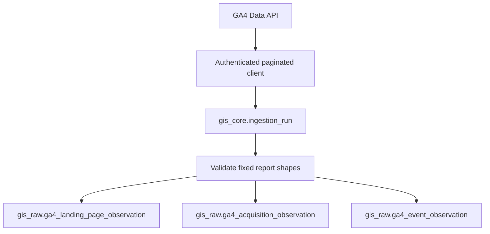

# Google Analytics 4 integration

## Scope and data flow

Epic 3 collects aggregate GA4 Data API reports. It does not collect users, client IDs, event
payloads, revenue, calculator telemetry, or attribution models.



The fixed report catalog is `landing-page`, `acquisition`, and `events`; `all` selects all three.
This avoids arbitrary dimension/metric combinations that can be incompatible or change row
meaning. Landing pages use GA4's `landingPage` dimension, excluding query strings to avoid
fragmenting otherwise identical entry pages.

## Authentication and configuration

Enable the Google Analytics Data API and Analytics Admin API, then grant the principal read
access to the explicit numeric GA4 property. Service-account and OAuth credentials use the
read-only Analytics scope. OAuth consent and token acquisition happen outside GIS.

Credentials resolve at runtime from `env:VARIABLE_NAME` or `file:/absolute/secure/path.json`.
Only the reference is stored; secrets and provider response bodies are not logged.

```bash
export GA4_SERVICE_ACCOUNT_JSON="$(< /secure/path/ga4-service-account.json)"
gis-ga4 configure \
  --tenant vahomemath \
  --site vahomemath \
  --property-id 123456789 \
  --credential-reference env:GA4_SERVICE_ACCOUNT_JSON \
  --auth-mode service_account
gis-ga4 validate --connection <connection-uuid>
```

Validation checks property metadata and a minimal Data API report, reports the property's IANA
timezone, and changes the connection from `PENDING` to `ACTIVE` without changing provider
configuration. Property identity is never
inferred from the site's URL. Re-running configure for the same tenant, site, and property updates
that connection.

## Sync and recovery

The default window is the three complete property-local dates ending yesterday:

```bash
gis-ga4 sync --connection <connection-uuid> --recent-days 3 --dataset all
gis-ga4 sync --connection <connection-uuid> \
  --start-date 2026-01-01 --end-date 2026-08-28 \
  --dataset landing-page --dataset events
```

Each dataset/date pair is requested and committed independently. Pagination follows GA4's
`limit`, `offset`, and `rowCount` until complete. HTTP 429, 5xx, and network failures receive four
bounded exponential-backoff attempts; permanent 4xx errors do not. A failure before any completed
chunk marks the run `FAILED`; a later failure preserves committed chunks and marks it `PARTIAL`.
Rerun the same range after correcting the problem. `--dry-run` validates and counts rows without
storing observations.

Rows retain connection, ingestion-run, rights-policy, observed, ingested, and effective-time
provenance. The connection's rights override wins over the source default; ingestion stops if no
policy resolves. The seed default remains conservatively `UNKNOWN`.

## Identity and revisions

Each table hashes tenant, site, connection, dataset, property-local date, and every dimension in
that report. Metrics, ingestion runs, and collection timestamps are excluded. Identical reruns are
no-ops. Revised metrics close the current row's `effective_end` and append a new row; a partial
unique index guarantees one current version.

## Interpretation limits

- GA4 Data API aggregates can differ from the GA4 interface because of reporting identity,
  attribution settings, modeling, filters, time of retrieval, and interface-specific behavior.
- High-cardinality reports may include an `(other)` row, while unset dimensions commonly appear
  as `(not set)`; GIS preserves provider values.
- Thresholding can suppress sensitive data. This catalog avoids demographic dimensions, but
  operators must still inspect GA4 metadata and privacy behavior.
- Recent dates can change as late events are processed; immutable revisions preserve changes.
- Date boundaries use the property's GA4 timezone, not UTC or the site's business timezone.
- Quota errors are retried only within the bounded request policy. Large backfills should use
  manageable ranges.

## Troubleshooting and tests

- `connection must be ACTIVE`: run validation first.
- HTTP 401/403: confirm API enablement, credentials, scope, property ID, and property access.
- timezone mismatch: reconfigure without a manual timezone and validate to refresh metadata.
- `PARTIAL`: inspect `error_summary` and `source_cursor`, then rerun the inclusive range.
- zero rows: confirm property, date availability, and that the fixed report has data.

Tests use fake transports and fictional aggregates; no live Google credentials are required.

## Epic 4 boundary

Future first-party telemetry should create typed event/session/calculator tables and use the
existing connection, run, rights, and provenance conventions. It must not reinterpret GA4
aggregates as raw first-party events or place sensitive event payloads in these tables.
Future dbt marts may reconcile GA4 report grains and join canonical pages, but Epic 3 deliberately
creates no marts and makes no promise that separate GA4 report totals reconcile exactly.
