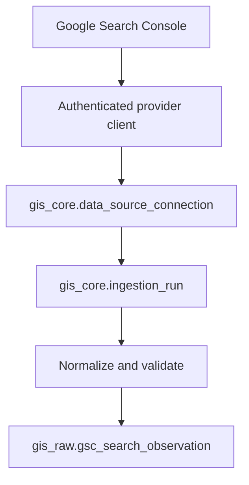

# Google Search Console integration

## Architecture

The integration uses the Epic 1 source, connection, rights, and run records directly:



The client owns HTTP, bounded transient retries, error translation, and `rowLimit`/`startRow`
pagination. The collector owns configuration, one-day chunks, run lifecycle, normalization,
rights resolution, versioning, and per-day transactions. This split makes the command suitable
for cron, systemd, a scheduled container, or a cloud scheduler without embedding a scheduler.

## Authentication and credentials

Both modes use Google's read-only webmasters scope:

- `service_account`: grant the service-account email explicit access to the property.
- `oauth`: supply JSON containing `refresh_token`, `client_id`, and `client_secret` from an
  out-of-band consent flow. Epic 2 does not provide a browser consent UI.

Credentials are JSON resolved at runtime from either `env:VARIABLE_NAME` or
`file:/absolute/secure/path.json`. PostgreSQL stores only that reference. Secret contents,
private keys, refresh tokens, access tokens, and bearer headers are never logged.

Service-account example:

```bash
export GSC_SERVICE_ACCOUNT_JSON="$(< /secure/path/gsc-service-account.json)"
```

OAuth example:

```bash
export GSC_OAUTH_JSON='{"refresh_token":"...","client_id":"...","client_secret":"..."}'
```

Keep credential files outside the repository and restrict their filesystem permissions.

## Configure and validate

Domain and URL-prefix properties are both supported. Property identity is explicit and is not
guessed from the site's canonical URL.

```bash
gis-gsc configure \
  --tenant vahomemath \
  --site vahomemath \
  --property-uri sc-domain:vahomemath.com \
  --credential-reference env:GSC_SERVICE_ACCOUNT_JSON \
  --auth-mode service_account \
  --grain query-page \
  --search-type web
```

The command returns a UUID and a `PENDING` status. It idempotently updates the same
site/source/property connection. Validate exact property access before syncing:

```bash
gis-gsc validate --connection <connection-uuid>
```

Successful validation changes the connection to `ACTIVE`. URL-prefix configuration uses the
exact value shown by Search Console, for example `https://www.example.com/`.

Optional grouping dimensions may be repeated:

```bash
--optional-dimension country \
--optional-dimension device \
--optional-dimension searchAppearance
```

Country and device filters are separate provider settings:

```bash
--country usa --device MOBILE
```

Search appearance has provider-specific query restrictions and can require a two-step query
strategy. Operators should validate a requested shape against their property before scheduling
it; this epic preserves returned values but does not invent or remap appearance categories.

## Collection

Daily incremental collection defaults to the three dates ending yesterday. GSC interprets
reporting dates in Pacific time; each stored `observed_at` reflects Pacific midnight converted
to UTC.

```bash
gis-gsc sync --connection <connection-uuid> --recent-days 3
```

Historical backfill uses explicit inclusive dates and one request range per day:

```bash
gis-gsc sync \
  --connection <connection-uuid> \
  --start-date 2026-01-01 \
  --end-date 2026-08-28 \
  --grain query-page
```

Use `--grain page` for the more complete page/date fallback. Use `--dry-run` to authenticate,
paginate, and validate rows while recording a run without writing observations.

Each run progresses `PENDING` to `RUNNING`, then `SUCCEEDED`, `PARTIAL`, or `FAILED`. Counters
record received, inserted, and rejected rows. Each completed day commits independently. If a
later day fails, prior days remain stored, the failed date appears in `error_summary`, and a
rerun safely resumes because already-identical observations are ignored.

## Identity and revisions

The observation key is stable SHA-256 over this ordered identity:

```text
tenant_id, site_id, connection_id, observed_date, search_type, collection_grain,
query, page, country, device, search_appearance
```

Metrics and ingestion timestamps are excluded. One partial unique PostgreSQL index enforces a
single current row for each key. An identical rerun inserts nothing. If clicks, impressions,
CTR, or position changes, GIS closes the old row's `effective_end` and appends the new current
version. The ingestion run always remains as collection history.

The applicable policy is the connection override when set, otherwise the source default. The
seeded default is deliberately `UNKNOWN`; ingestion fails if no policy resolves.

## Search Console interpretation limits

Search Analytics is Google's authoritative reported performance data, but it is not a census:

- privacy-protected/anonymized queries are omitted from query detail and are never fabricated;
- query/page grouping can drop data, so detail may not sum to chart or page totals;
- API performance data is currently limited to 50,000 rows per day, search type, and property;
- results favor top rows for the requested query shape;
- finalized data normally has a two-to-three-day latency and Google can revise prior dates;
- dates use Pacific time, which may differ from site or analytics timezones;
- domain properties and URL-prefix properties have different coverage;
- search appearance queries have additional provider constraints;
- Search Console and GA4 measure different systems and should not be expected to match.

The client requests finalized data, 25,000 rows per page, and follows `startRow` until a short or
empty page. These behaviors follow Google's current Search Analytics API guidance.

## Troubleshooting

- `connection must be ACTIVE`: run `gis-gsc validate` first.
- `configured property is not accessible`: grant the credential principal access and confirm
  the exact `sc-domain:` or URL-prefix value.
- `credential environment variable ... is unset`: export it in the scheduled process environment.
- HTTP 401/403: credentials or access are invalid; these errors are not retried.
- HTTP 429/5xx/network failure: the client retries four times with exponential backoff and jitter.
- `PARTIAL`: inspect the failed date in `error_summary`, correct the cause, and rerun the range.
- zero rows: verify property identity, date availability, search type, and filters.

## Tests

CI uses fake provider transports and fictional rows; it needs no Google account. The suite covers
configuration, credential references, normalization, numerical fidelity, pagination, zero-row
termination, run states, partial commits, counters, versioning, idempotent backfills, recovery,
rights inheritance, tenant isolation, migration creation, drift, lint, typing, and builds.
