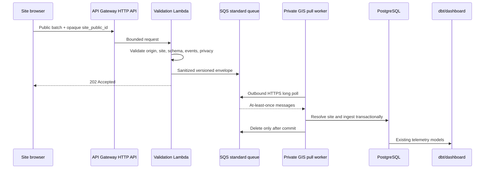

# Production first-party telemetry

## Architecture and trust boundaries



The browser/AWS edge is an untrusted public collection plane. SQS is a durable transport boundary. The worker, GIS domain, PostgreSQL, dbt, and dashboard remain private; no Lambda, tunnel, VPN, or AWS service connects to the private network. The worker initiates outbound AWS API calls.

AWS is not part of the canonical telemetry schema. `PublicTelemetryBatch` and `QueueEnvelope` are versioned provider-neutral contracts. AWS identifiers live in ingestion-run metadata and `telemetry_transport_batch`, never event properties.

## Public site registration and tenancy

Every `gis_core.site` has a random UUID `public_id`, unique globally. Browsers send only this opaque value. The Lambda deployment registry maps each public ID to exact allowed origins. The worker resolves the public ID to the canonical `tenant → organization/client → site` hierarchy and supplies tenant/site slugs internally; browsers cannot select internal ownership fields.

For the first site, pass a registry such as:

```json
{"SITE-PUBLIC-UUID":["https://www.vahomemath.com","https://vahomemath.com"]}
```

Only include production origins the deployed application genuinely uses. Origin is forgeable and is an abuse-reduction signal, not authentication. At larger scale, replace the environment registry with a signed/config-managed edge registry or low-latency managed lookup without changing the public or canonical contracts.

Retrieve the public ID after migration and seed:

```sql
select public_id from gis_core.site where slug = 'vahomemath';
```

## Edge validation and privacy

The Lambda accepts schema `1`, at most 50 events, and at most 64 KiB. It enforces an envelope allowlist, UUIDs, timestamps, event taxonomy/version, event-specific property allowlists, a 4 KiB property limit, HTTP(S) URLs, configured public IDs, and exact origins. Query strings and fragments are removed from URLs and paths. Unknown properties and sensitive-looking keys are rejected.

Never send names, email, phone, addresses, free text, credentials, cookies, tokens, fingerprints, exact financial values, or arbitrary form values. AWS necessarily observes transient connection metadata such as source IP at its service boundary. The application never copies it into messages or logs. Lambda logging is metadata-only and retained for 14 days by default. API Gateway service/access logging is not enabled by this stack.

The browser contains no secret. API throttling, queue isolation, strict schemas, UUID replay safety, and validation bound abuse. A forged Origin and copied public ID can still generate schema-valid junk; monitor volume and rotate a site public ID or tighten throttles during abuse. WAF is deliberately deferred.

## Infrastructure and deployment

The SAM template creates an HTTP API, 128 MiB ARM Lambda, encrypted Standard queue and DLQ, least-privilege Lambda send policy, a separate least-privilege worker policy, 14-day Lambda logs, throttling, and alarms for Lambda errors, queue age, and DLQ depth. There is no VPC, NAT gateway, RDS, load balancer, server, or fixed-cost compute.

```bash
cd infrastructure/telemetry
sam validate --lint
sam build
sam deploy --guided \
  --stack-name gis-production-telemetry \
  --parameter-overrides 'SiteRegistryJson={"SITE-PUBLIC-UUID":["https://www.vahomemath.com"]}'
```

Review the CloudFormation change set, IAM capabilities, region, registry, alarm destination, and tags before approving deployment. Do not deploy from an administrator identity as routine practice. Attach the output worker policy to a dedicated worker principal using an AWS profile, environment credential chain, or future IAM role.

## Worker, retries, idempotency, and provenance

```bash
gis-telemetry-worker run --queue-url QUEUE_URL --profile gis-telemetry
gis-telemetry-worker run --queue-url QUEUE_URL --once
```

The worker long-polls up to ten messages, validates the envelope again, resolves the site, runs canonical telemetry validation, and deletes only after database commit. Empty polls are normal. Validation/database/network failures leave the message for retry; SQS moves it to the DLQ after five receives. Stop signals finish the current bounded poll.

The database uniquely constrains events, sessions, calculator runs, and conversions within tenant/site scope. SQS message IDs are uniquely recorded. A retry after a partial infrastructure failure therefore produces duplicates, not duplicate canonical activity. Ordering is not assumed; canonical timestamps and session `last_event_at` tolerate late events. Lifecycle events that refer to a not-yet-seen calculator run remain retryable failures until the start event arrives or the message reaches the DLQ.

Every queue message creates an `ingestion_run` with source connection, source acquisition method, rights policy, schema/collector version, batch/trace/message identifiers and counters. Events link to that run. `telemetry_transport_batch` accounts for batches, bytes, accepted/rejected events and duplicates by site/period. Existing first-party rights remain `UNKNOWN` until explicitly reviewed. Existing dbt lineage from session/event/calculator/conversion raw assets to marts remains unchanged.

## Batching and schema compatibility

Clients collect up to ten events in memory, flush after one second or at the limit, and use `sendBeacon` on lifecycle boundaries with short-timeout `fetch` fallback. Retries are not unbounded and edge-case loss is acceptable. Website interactions never await telemetry.

Transport schema `1` is the only supported version. Unsupported versions receive HTTP 400 and are not queued. A future version should be added alongside v1 for a documented overlap window because sites will not deploy simultaneously; remove an old version only after its traffic reaches zero.

## Cost model

Illustrative assumptions, reviewed 2026-08-30: 8 events/session, 5 events/batch, 2 batches/session, sub-64-KiB messages, 128 MiB Lambda under 100 ms, API Gateway HTTP API at $1/million requests, Lambda at $0.20/million requests plus duration, and three Standard SQS operations per batch. Free-tier credits are excluded; CloudWatch/log storage and data transfer vary. Confirm the selected region with the AWS Pricing Calculator before deployment.

| Sessions/month | Batches | Illustrative request cost* |
|---:|---:|---:|
| 1,000 | 2,000 | <$0.01 |
| 10,000 | 20,000 | ~$0.05 |
| 25,000 | 50,000 | ~$0.12 |
| 75,000 | 150,000 | ~$0.36 |
| 150,000 | 300,000 | ~$0.72 |
| 300,000 | 600,000 | ~$1.44 |
| 1,000,000 | 2,000,000 | ~$4.80 |

\*Uses a conservative combined request assumption of $2.40/million batches; compute, logs, retention, transfer, taxes, region differences, and free tier can change totals. Main drivers are batches, message size/request units, Lambda duration, SQS polling discipline, and logs.

## Operations, DLQ, and incidents

Monitor Lambda errors, queue depth/oldest age, worker structured counters, and DLQ depth. For a DLQ incident: stop broad replay, inspect message metadata without printing payloads, identify validation/schema/site/database cause, deploy the correction, redrive a small sample, confirm idempotency and queue drain, then redrive the remainder. Never copy payloads into tickets or chat.

If abuse occurs, preserve evidence only through aggregate metrics, reduce API throttles, remove/rotate the public site registry entry, and redeploy. If credentials leak, rotate the dedicated worker credentials; the browser has none. If the private database is unavailable, leave messages queued and restore it before visibility/retention expires.

## VAHomeMath activation checklist

1. Migrate and seed GIS; retrieve the site's `public_id`.
   Configure its active connection with `gis-telemetry configure --tenant TENANT --site SITE --transport aws_sqs`.
2. Deploy/review the AWS stack with only legitimate origins.
3. Configure a least-privilege worker identity and run the worker privately.
4. Verify alarms and an empty DLQ.
5. Set `NEXT_PUBLIC_GIS_TELEMETRY_COLLECTOR_URL`, `NEXT_PUBLIC_GIS_TELEMETRY_SITE_ID`, and finally `NEXT_PUBLIC_GIS_TELEMETRY_ENABLED=true` in Amplify.
6. Redeploy VAHomeMath and perform one synthetic lifecycle test without financial inputs.
7. Confirm queue drain, canonical events, ingestion provenance, dbt rows, dashboard behavior, and empty DLQ.

Production transmission remains disabled until step 5 is performed deliberately.
