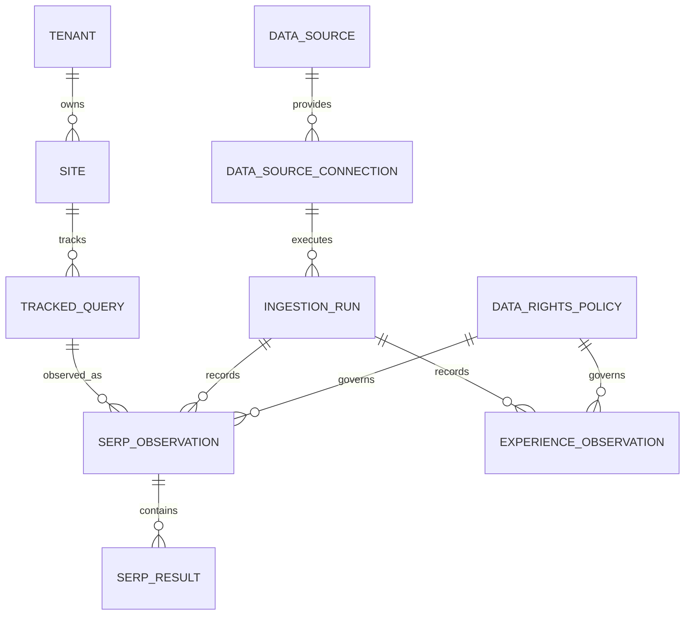

# SERP and experience intelligence

Epic 15 adds provider-neutral, historical search-result and web-experience observations. DataForSEO is the first SERP adapter; PageSpeed Insights supplies CrUX field data and Lighthouse lab data. Provider payloads are normalized before persistence, so another approved provider can implement the same service boundary without changing analytical tables.

## Canonical model



Tracked-query uniqueness uses tenant, site, normalized query, engine, country, location, language, and device. Normalization trims, case-folds, and collapses whitespace; analytical GSC matching applies the same exact normalization and deliberately does not fuzzy match.

SERP observations are append-oriented. Recollection of the same tracked query, UTC observation date, device, and location closes the previous effective record and inserts a new current revision. Result URLs must be absolute HTTP(S); query strings and fragments are removed for deterministic comparison. Domains already attached to the site are `OWN_SITE`; domains marked `COMPETITOR` are `KNOWN_COMPETITOR`; all others are `OTHER`.

Canonical feature values are `ORGANIC`, `PAID`, `FEATURED_SNIPPET`, `AI_ANSWER`, `PEOPLE_ALSO_ASK`, `LOCAL_PACK`, `IMAGE`, `VIDEO`, `SHOPPING`, `KNOWLEDGE_PANEL`, `NEWS`, `DISCUSSION_FORUM`, `RELATED_SEARCH`, `SITELINK`, `MAP`, `OTHER`, and `UNKNOWN`. The adapter maps DataForSEO types deterministically and retains the original type. New nonempty types become `OTHER`, never organic; absent types become `UNKNOWN`.

## Collection and cost control

DataForSEO uses the Google Organic Live Advanced endpoint. Connections retain only a credential reference. For the CLI, `env:VARIABLE` points to ignored JSON containing `login` and `password`. Provider request validation happens before HTTP: keyword and two-letter language must be present, device must be `desktop` or `mobile`, depth must be 1–200, and exactly one geographic target must resolve.

Geographic translation stays inside the adapter. An explicit `location_code` takes precedence; otherwise an explicit `location_name` is sent. When neither is supplied, a canonical country code must resolve through the adapter's reviewed DataForSEO country-location mapping. `US` maps to DataForSEO's United States location code `2840`. Unmapped countries fail closed before HTTP rather than silently producing an untargeted request. Supplying both location fields is rejected as ambiguous.

DataForSEO top-level and task-level `status_code` values are validated independently; `20000` is treated as success. Malformed JSON, malformed tasks/results, provider failures, and a null result produce sanitized provider exceptions. Safe status codes/messages are retained in the failed ingestion run, but credentials, authorization data, and request headers are not. A successful task with an empty result array is a successful zero-record run, not a provider failure. The first successful provider collection, including a legitimate empty SERP, changes the connection from `PENDING` to `ACTIVE`; local credential availability alone does not.

Cost estimation is configuration-driven. `--unit-cost` is cost per provider task; the CLI default is **USD 0.002**, an operational placeholder last reviewed 2026-08-29, not a claim about current DataForSEO pricing. Monthly cadence multipliers are 1 for one-time, 4.345 for weekly, and 30 for daily. Formula: `ceil(queries × cadence multiplier) × unit cost`. Confirm current contract pricing before collection. Live sync can be billable, and the endpoint bills in result-depth increments, so depth above 10 can increase task cost.

```bash
gis-serp configure --tenant vahomemath --site vahomemath --credential-reference env:DATAFORSEO_CREDENTIAL_JSON
gis-serp validate --connection UUID
gis-serp add --tenant vahomemath --site vahomemath --query "VA loan calculator" --device mobile --location-code 2840 --depth 20 --cadence WEEKLY
gis-serp list --tenant vahomemath --site vahomemath
gis-serp estimate --queries 100 --cadence WEEKLY --unit-cost 0.002
gis-serp sync --connection UUID --query-id UUID
gis-serp inspect --limit 10
```

Use an external scheduler to invoke active daily or weekly query sets. The epic intentionally adds no scheduler. Tests use fixtures and never make billable requests.

`gis-serp validate` checks only that the referenced credential value is locally available and parseable. It does not contact DataForSEO, prove authentication, or activate the connection. `gis-serp sync` is the controlled live-provider check and may incur a charge; on failure its JSON output includes the persisted sanitized diagnostic.

## Experience semantics

PageSpeed responses are split into CrUX `FIELD` observations and Lighthouse `LAB` observations. `URL` and `ORIGIN` scopes and `MOBILE`/`DESKTOP` form factors remain explicit. Field distributions retain good, needs-improvement, and poor proportions. A valid response without CrUX or Lighthouse metrics becomes `INSUFFICIENT_DATA`, not a failed run. Transport/provider errors yield a failed ingestion run.

CWV classification uses the documented 75th-percentile boundaries: LCP good at ≤2.5s and poor above 4s; INP good at ≤200ms and poor above 500ms; CLS good at ≤0.1 and poor above 0.25. Boundary values remain in the better category.

```bash
gis-experience configure --tenant vahomemath --site vahomemath --credential-reference env:PAGESPEED_API_KEY
gis-experience validate --connection UUID
gis-experience sync --connection UUID --target https://vahomemath.com/calculator --form-factor MOBILE --scope URL
gis-experience inspect --limit 20
```

PageSpeed may be called without an API key for limited use; omit the credential reference. Never place a key in connection JSON.

## Analytics and provenance

Staging models expose current SERP revisions, results, and experience observations. Intermediate models aggregate query/day, domain/day, and feature presence. Marts are:

- `mart_serp_query_daily`: own rank/presence, counts, diversity, feature density, visibility, and top-10 churn.
- `mart_serp_domain_daily`: best rank and transparent organic-position share.
- `mart_serp_visibility_daily`: site/day rollup.
- `mart_serp_feature_daily`: canonical feature presence.
- `mart_page_experience`: pivoted LCP, INP, CLS and classifications by period/type/scope/device.
- `mart_search_experience`: exact-query GSC metrics, best observed owned result, and same-date URL experience.

Top-10 churn is `1 - current top-10 URLs also present in the prior observation / current top-10 URL count`. It is null without a prior observation. This is a descriptive measure, not anomaly detection. Search/experience joins are correlational and make no causal ranking claim.

Run `dbt build`, then register the generated manifest:

```bash
gis-provenance register-dbt --manifest analytics/target/manifest.json
gis-provenance trace gis_analytics.mart_serp_query_daily
```

The trace follows dbt dependencies to `gis_raw.serp_observation`/`serp_result`, then DataForSEO. Experience raw assets link to PageSpeed. Sources use the seeded unreviewed policy: every permission remains `UNKNOWN` until a reviewed policy is attached, so governed downstream use fails closed.

## Limitations and extension

The initial adapter uses synchronous live tasks and does not retry automatically; scheduled orchestration may retry failed queries independently. A single CLI invocation collects one query, making partial-batch behavior an orchestration concern. Raw provider payloads are not retained, only small diagnostic metadata. Future providers should implement the provider protocol and canonical taxonomy; future opportunity rules may consume these marts but do not belong in this epic.
